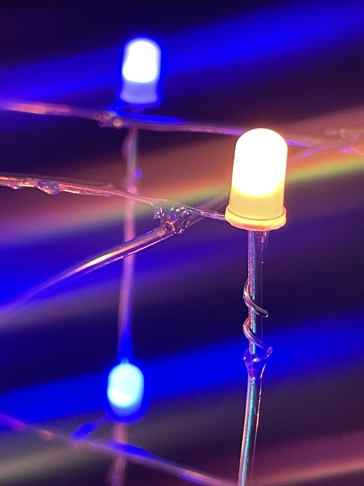
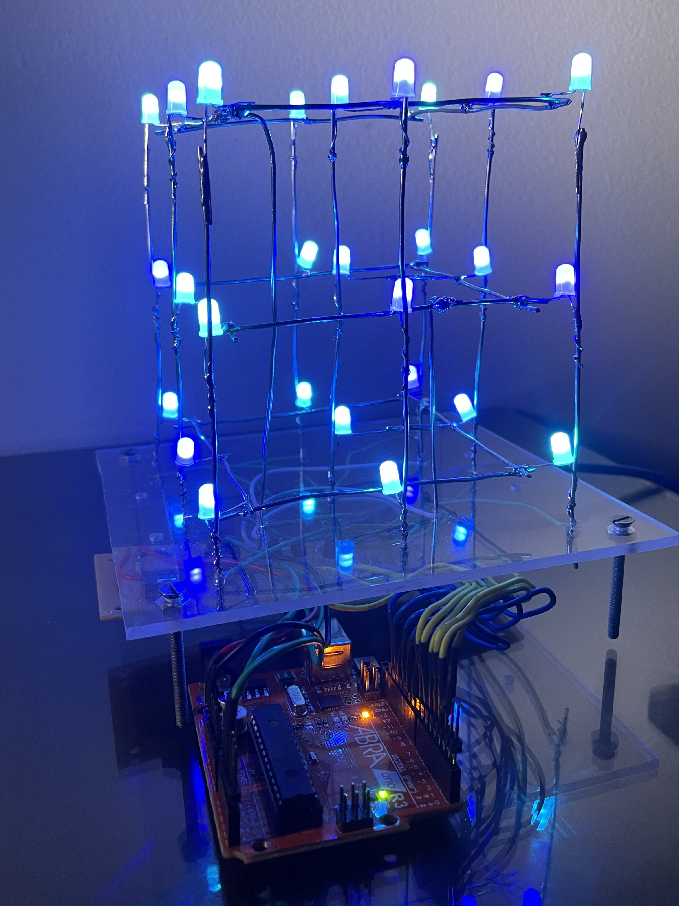
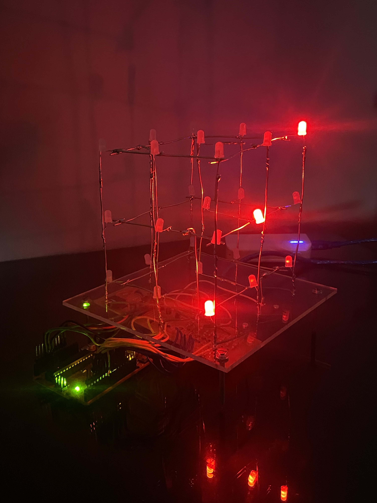
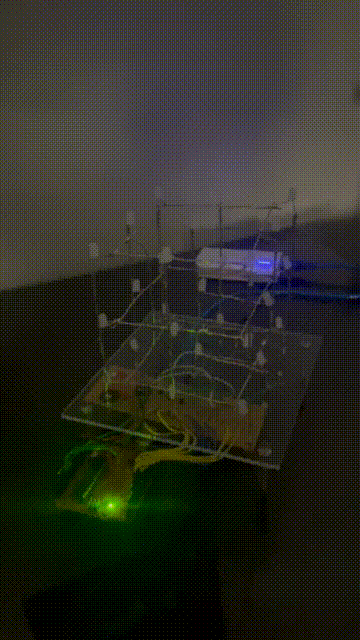
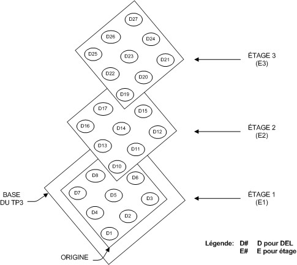

# 3x3x3-LED-CUBE
 This 3x3x3 Arduino LED cube is a stunning visual display that utilizes 9 LEDs in each of its 3 layers to create a stunning array of light. The cube is controlled by an Arduino microcontroller, which allows users to program and customize their own light patterns and sequences.

# Images
  

# Demo 1
### The RGB LEDs are all activated at the same time on all stages.

# Demo 2
### The RGB LEDs are all on at the same time per stage; the other 2 stages are off.

# Demo 3
### The purpose of this third sequence is to experiment with the multiplexing of the stages. The idea is to activate in rapid sequence the 3 stages so that to the eye, only the selected LEDs seem to be lit all at the same time.

# Demo 4
### This fourth sequence aims to experiment the multiplexing of the stages which changes in time. Still multiplexing rapidly the 3 stages, it consists in lighting a diagonal on the side of the 3x3x3 cube alternating with the opposite side every 500 ms. At all times, only 3 LEDs are lit simultaneously.

# Demo 5
### Original sequence

# Layout

